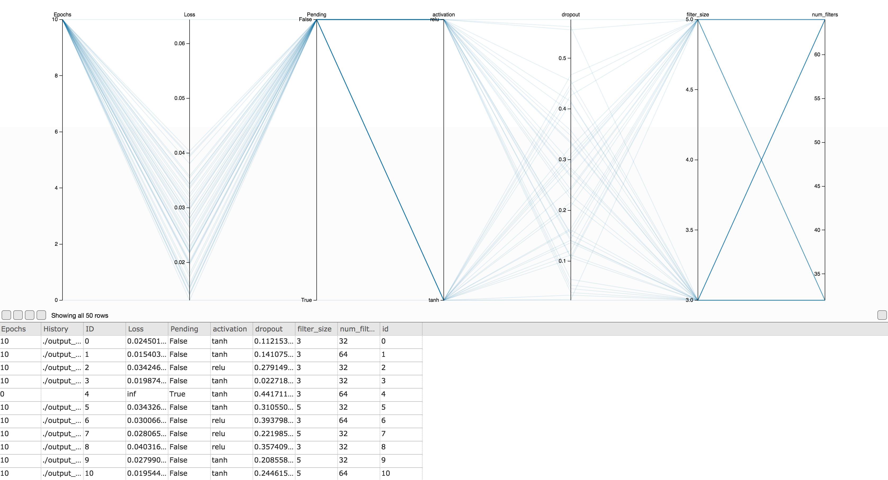

# SHERPA

Welcome to SHERPA - a hyperparameter tuning framework for machine learning.
In order to get SHERPA running clone the repository from GitLab by
calling ```git clone git@gitlab.ics.uci.edu:uci-igb/sherpa.git``` from the
command line and adding the directory to the Python path (e.g.
```export PYTHONPATH=$PYTHONPATH:/user/local/sherpa/```). In order to get the
necessary dependencies you can run ```python setup.py``` from the SHERPA folder.

### Dependencies
+ Numpy 1.13.1
+ Pandas 0.19.2
+ Keras (for examples)
+ GPU Lock (for examples)

## Getting Started
For a first step navigate to ```sherpa/examples``` and run
```python optimize_bianchini.py```. In this example SHERPA calls the script
```bianchini.py``` which trains a shallow neural network in Keras to learn the
Bianchini function. The script ```bianchini.py``` is repeatedly called with
different hyperparameters which are passed via command line arguments. By the
end of the optimization SHERPA will give you the best hyperparameters. This
example can be run on your laptop.

## Optimizing a CNN for MNIST
The next example runs a small hyperparameter optimization on a Convolutional
Neural Network trained on the MNIST dataset in Keras. If you have a GPU machine
available this will speed up the running time of the
optimization significantly. You can go ahead and run
```python sherpa_mnist.py```. This executes the script ```mnist_convnet.py```
with hyperparameter configurations as defined in ```sherpa_mnist.py```.

### Training in Parallel
By default the script trains one model at a time. Use 
```python sherpa_mnist.py --max_concurrent [no of processes]``` to train
```[no of processes]``` models in parallel.
If you have GPUs this should be set to the number of available GPUs on the
machine. If you have a machine with many CPUs you can set this to the number of
CPUs you intend to use. By viewing `sherpa_mnist.py` you can see this sets
`max_concurrent` in `sherpa.optimize`. This is the argument that controls the
number of processes to run.

### Visualizing Results
After running ```python sherpa_mnist.py``` SHERPA will display output in the terminal.
Among this you will see the address of the dashboard.  If you visit the the address in your web-browser you will see a
parallel coordinates plot and a table as shown in the screenshot below.
The table shows the results so far. Hit
refresh to get the latest results. Each row represents one trial consisting of
a hyperparameter configuration and the metric (e.g. loss).
You can brush over any axis in the plot to select corresponding rows. Once the
optimization finishes the webserver
shuts down. To view
the results again go to the output folder (here ```output_[datetime]```).
Now call ```python -m SimpleHTTPServer 6006```
from the command line (or ```python -m http.server 6006``` for Python 3).



### SGE
In addition to the local scheduler that you used above SHERPA also supports
Sun Grid Engine (SGE). This can be useful if you want to use GPUs across
multiple machines. You can call  ```python sherpa_mnist.py --sge``` and pass
the SGE project name ```-P```, the queue name ```-q``` and the resources
```-l``` as arguments. __Baldi Group:__ Call ```python sherpa_mnist.py --sge```
from nimbus.ics.uci.edu and the script will run on Arcus 5 to 9 machines.

## Authoring your own Optimization

You define a SHERPA optimization via the function ```sherpa.optimize()```. This
expects at minimum a `filename` for the training code and an algorithm. For
all arguments view the API section below.

### The Training Code
SHERPA expects your training code to be contained in one file. This should be a
script that expects hyperparameters via the command line arguments. The training
needs to submit metrics at least once at the end using the
```sherpa.send_metrics``` function. A simple example of this could have the
following structure
```python
import argparse
import sherpa

parser = argparse.ArgumentParser()
parser.add_argument('--my_parameter', type=float, default=0.5)
# Args used by scheduler.
parser.add_argument('--index', type=int, default=0)
parser.add_argument('--metricsfile', type=str)
parser.add_argument('--modelfile', type=str)
FLAGS = parser.parse_args()

# Train my model with my_parameter and produce list of losses l = [0.1, 0.05]

sherpa.send_metrics(index=FLAGS.index, metrics=l,
                    metricsfile=FLAGS.metricsfile)
```

### The Optimization Code

Next, SHERPA needs a Python script that defines and runs the optimization.
You first define a list of ```sherpa.Hyperparameter``` objects. These define the
parameters you want to tune. This is passed to one of the algorithms in 
```sherpa.algorithms```. See below for a list of all available algorithms. By
default SHERPA uses the local scheduler (```sherpa.schedulers.LocalScheduler```)
. This will execute jobs on the machine that SHERPA is run on. You can also use
the SGE scheduler. The SGE scheduler expects an environment and submit options.
The optimization to the example above could look like the following.

```python
from sherpa.hyperparameters import DistributionHyperparameter as Hyperparameter

hp_space = [
    Hyperparameter(name='my_parameter',
                   distribution='uniform',
                   dist_args=[0., 1.])
]

algorithm = sherpa.algorithms.RandomSearch(samples=50, hp_ranges=hp_space)
dir = './my_dir'
sched = LocalScheduler()

sherpa.optimize(filename='my_script.py',
                algorithm=alg,
                dir=dir,
                scheduler=sched,
                max_concurrent=2)
```

## API
Below is a list of functions that are needed to set up a SHERPA optimization.
#### sherpa.hyperparameters.DistributionHyperparameter
Hyperparameter with a specified distribution.

__Arguments__

- __name__ _(str)_: The hyperparameter name.
- __distribution__ _(str, default='uniform')_: Name of distribution as provided
by numpy.random or "log-uniform".
- __dist_args__ _(list/dict)_: Distribution arguments as accepted by
`numpy.random.[distribution]`.
- __seed__ _(int, default=None)_: Seed for the random number generator.

#### sherpa.optimize 
Initializes and runs Sherpa optimization.

__Arguments__

- __filename__ _(str)_: File that runs training. Accepts hyperparameters via
command line and submits results via ```sherpa.send_metrics```.
- __algorithm__ _(sherpa.algorithms.AbstractAlgorithm)_: Sherpa algorithm.
- __dir__ _(str)_: Sherpa models are saved in (dir)/sherpa_models/.
- __results_table__ _(sherpa.resultstable.AbstractResultsTable)_: Sherpa
ResultsTable object to use.
- __loss__ _(str)_: Key specifying which channel to minimize.
- __overwrite__ _(bool)_: If True, deletes existing files in (dir).
- __scheduler__ _(sherpa.schedulers.AbstractScheduler)_: Sherpa Scheduler
object, defaults to LocalScheduler with single process
(serial mode).
- __max_concurrent__ _(int)_: Limits the number of jobs Sherpa submits to
scheduler.

#### sherpa.schedulers.LocalScheduler
Runs jobs as subprocesses on local machine.

#### sherpa.schedulers.SGEScheduler
Submits jobs to SGE.

__Arguments__

- __environment__ _(str)_: Path to an environment to be used when submitting
jobs to SGE.
- __submit_options__ _(str)_: Submit options for SGE in command line flags
format.


### Supported Algorithms
#### sherpa.algorithms.RandomSearch
Random Search over hyperparameter space.

__Arguments__

- __samples__ _(int)_: Number of trials to evaluate.
- __hp_ranges__ _(list)_: List of Hyperparameter objects.

