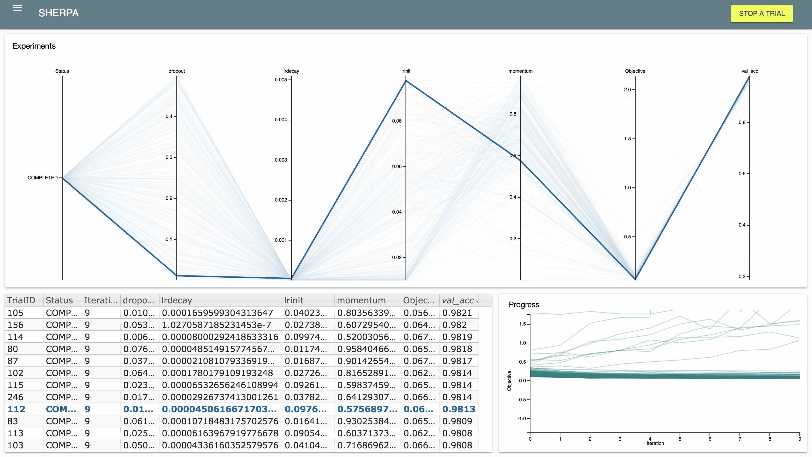

Welcome to SHERPA!
==================

SHERPA is a Python library for hyperparameter tuning of machine learning models.

Its goal is to provide:

* implementations of hyperparameter optimization algorithms
* parallel computation that can be fitted to the user's needs
* a live dashboard for the exploratory analysis of results.

The documentation provides tutorials on parallel computation and different
hyperparameter search algorithms.

.. _keras-to-sherpa-api:

From Keras to Sherpa in 30 seconds
==================================

Here we will show how to adapt a minimal Keras script so it can
be used with Sherpa. As starting point we use the "getting started in 30 seconds"
tutorial from the Keras webpage.

We start out with this piece of Keras code:

::

    from keras.models import Sequential
    from keras.layers import Dense
    model = Sequential()
    model.add(Dense(units=64, activation='relu', input_dim=100))
    model.add(Dense(units=10, activation='softmax'))
    model.compile(loss='categorical_crossentropy',
              optimizer='sgd',
              metrics=['accuracy'])

We want to tune the number of hidden units via Random Search. To do that, we
define one parameter of type `discrete`.
We also use the `Random Search` algorithm with maximum number of trials 50.

::

    import sherpa
    parameters = [sherpa.Discrete('num_units', [50, 200])]
    alg = sherpa.algorithms.RandomSearch(max_num_trials=50)

We use these objects to create a SHERPA Study:

::

    study = sherpa.Study(parameters=parameters,
                         algorithm=alg,
                         lower_is_better=True)

We obtain `trials` by iterating over the study. Each `trial` has a `parameter`
attribute that contains the ``num_units`` parameter value. We can use that value
to create our model.

::

    for trial in study:
        model = Sequential()
        model.add(Dense(units=trial.parameters['num_units'],
                        activation='relu', input_dim=100))
        model.add(Dense(units=10, activation='softmax'))
        model.compile(loss='categorical_crossentropy',
                  optimizer='sgd',
                  metrics=['accuracy'])

        model.fit(x_train, y_train, epochs=5, batch_size=32)
        loss, accuracy = model.evaluate(x_test, y_test, batch_size=32)

        study.add_observation(trial, objective=loss, iteration=1)
        study.finalize(trial)

At the end of training each model we tell SHERPA about the test loss using
``study.add_observation`` and finalize the trial using ``study.finalize``. The
latter means that no more observation will be added to this trial.

When the ``Study`` is created, SHERPA will display the dashboard address. If you
put the address into your browser you will see the dashboard as shown below. As a next step you
can take a look at this example of optimizing a Random Forest in
``sherpa/examples/randomforest/breastcancer.py``.

Installation from GitHub
------------------------

Clone into ``/your/path/`` from GitHub:

::

    cd /your/path/
    git clone git@gitlab.ics.uci.edu:uci-igb/sherpa.git

Add SHERPA to Python-path:

::

    export PYTHONPATH=$PYTHONPATH:/your/path/sherpa/

Install dependencies:

::

    pip install pandas
    pip install numpy
    pip install scipy
    pip install scikit-learn
    pip install flask
    pip install enum34  # if on < Python 3.4

You can run an example to verify SHERPA is working:

::

    cd /your/path/sherpa/examples/
    python api_mode.py

Note that to run hyperparameter optimizations in parallel with SHERPA requires
the installation of Mongo DB. Further instructions can be found in the
Parallel Installation section of the documentation.