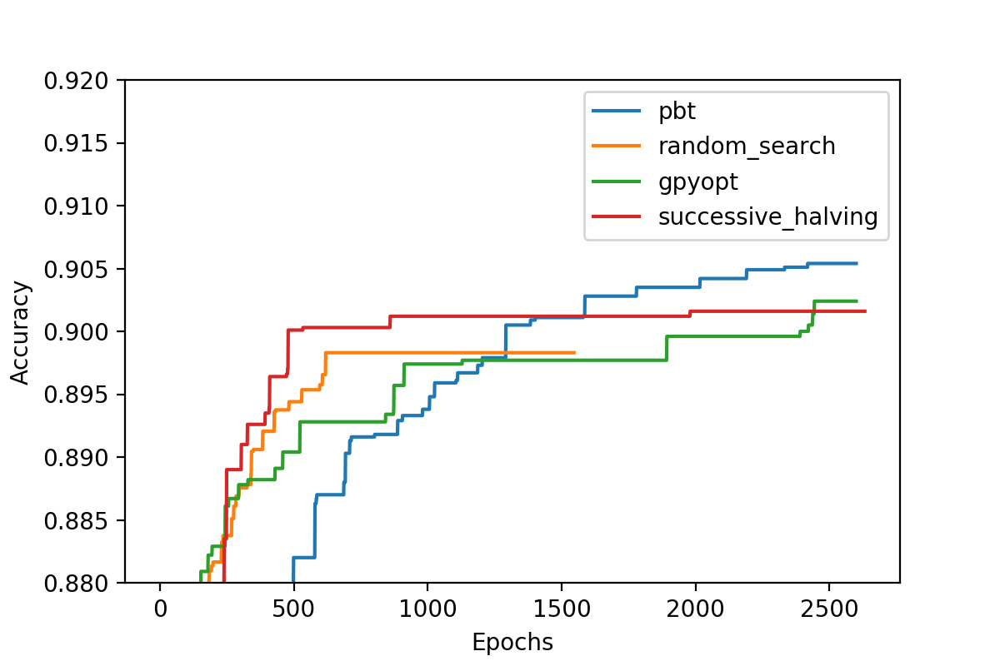

.. _available-algorithms:

Available Algorithms
====================

This section provides an overview of the available hyperparameter optimization
algorithms in Sherpa. Below is a table that discusses use cases for each
algorithm. This is followed by a short comparison benchmark and the algorithms themselves.

+-------------------+-----------------------------------------------------------+
|                   | Use cases                                                 |
+-------------------+-----------------------------------------------------------+
| | Grid Search     | | Great for understanding the                             |
|                   | | impact of one or two parameters.                        |
+-------------------+-----------------------------------------------------------+
| | Random Search   | | More efficient than grid search when used with many     |
|                   | | hyperparameters. Great for getting                      |
|                   | | a full picture of the impact of many hyperparameters    |
|                   | | since hyperparameters are uniformly sampled from the    |
|                   | | whole space.                                            |
+-------------------+-----------------------------------------------------------+
| | GPyOpt Bayesian | | More efficient than Random search when the number of    |
| | Optimization    | | trials is sufficiently large.                           |
+-------------------+-----------------------------------------------------------+
| | Asynchronous    | | Due to its early stopping, especially useful when it    |
| | Successive      | | would otherwise be infeasible to run a hyperparameter   |
| | Halving         | | optimization because of the computational cost.         |
+-------------------+-----------------------------------------------------------+
| | Local Search    | | Can quickly explore "tweaks" to a model that is         |
|                   | | already good while using less trials than Random search |
|                   | | or Bayesian optimization.                               |
+-------------------+-----------------------------------------------------------+
| | Population      | | Can discover *schedules* of training parameters and is  |
| | Based           | | therefore especially good for learning rate, momentum,  |
| | Training        | | batch size, etc.                                        |
+-------------------+-----------------------------------------------------------+

For the specification of each algorithm see below.

Comparison using Fashion MNIST MLP
~~~~~~~~~~~~~~~~~~~~~~~~~~~~~~~~~~

We constructed a simple and fast to run benchmark to run these algorithms on. This uses a fully connected neural
network trained on the Fashion MNIST dataset. The tuning parameters are the learning rate, the learning rate
decay, the momentum, minibatch size, and the dropout rate. We compare Random Search, GPyOpt, Population Based Training (pbt),
and Successive Halving. All algorithms are allowed an equal budget corresponding to 100 models trained for 26 epochs. The
plot below shows the mean taken over five runs of each algorithm. The shaded regions correspond to two standard deviations.
On the y-axis is the classification accuracy of the best model found. On the x-axis are the epochs spent. We run 20 evaluations
in parallel. Note that the results of GPyOpt may be impacted by the high number of parallel evaluations. The code to reproduce
this benchmark can be found at ``sherpa/examples/parallel-examples/fashion_mnist_benchmark``. 

The currently available algorithms in Sherpa are listed below:

Grid Search
~~~~~~~~~~~

.. autoclass:: sherpa.algorithms.GridSearch
  :noindex:

Random Search
~~~~~~~~~~~~~

.. autoclass:: sherpa.algorithms.RandomSearch
  :noindex:

Bayesian Optimization with GPyOpt
~~~~~~~~~~~~~~~~~~~~~~~~~~~~~~~~~

.. autoclass:: sherpa.algorithms.GPyOpt
  :noindex:

Asynchronous Successive Halving aka Hyperband
~~~~~~~~~~~~~~~~~~~~~~~~~~~~~~~~~~~~~~~~~~~~~

.. autoclass:: sherpa.algorithms.SuccessiveHalving
  :noindex:

Local Search
~~~~~~~~~~~~

.. autoclass:: sherpa.algorithms.LocalSearch
  :noindex:

Population Based Training
~~~~~~~~~~~~~~~~~~~~~~~~~

.. autoclass:: sherpa.algorithms.PopulationBasedTraining
  :noindex:

Repeat
~~~~~~

.. autoclass:: sherpa.algorithms.Repeat
  :noindex:

Iterate
~~~~~~~

.. autoclass:: sherpa.algorithms.Iterate
  :noindex:
