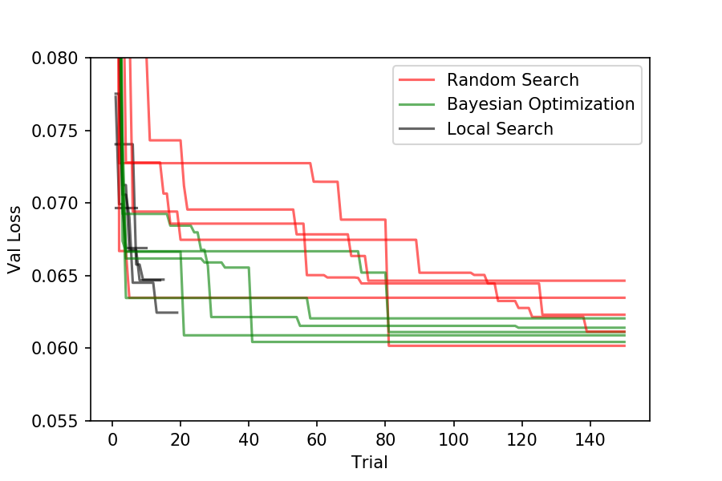
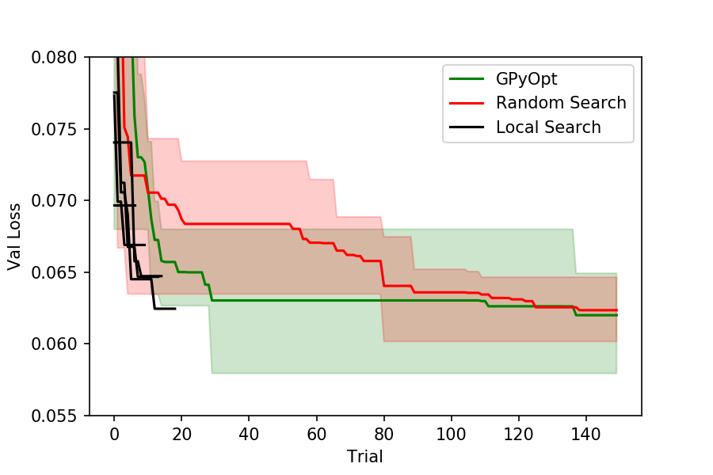

.. _available-algorithms:

Available Algorithms
====================

This section provides an overview of the available hyperparameter optimization
algorithms in Sherpa. Below is a table that discusses advantages and disadvantages to each
algorithm. This is followed by a short comparison benchmark and the algorithms themselves.

+----------------+--------------------------------+------------------------------------+
|                | Advantages                     | Disadvantages                      |
+================+================================+====================================+
| Grid Search    | | Great for understanding the  | | Every variable is categorized so |
|                | | relationship between one     | | the information gain about it is |
|                | | or two hyperparameters and   | | limited. Best to avoid when      |
|                | | the objective (validation    | | number of hyperparameters is     |
|                | | error).                      | | larger than 2.                   |
+----------------+--------------------------------+------------------------------------+
| Random Search  | | Theoretical guarantees to    | | If a large number of trials is   |
|                | | to find global minimum.      | | evaluated there is no use of     |
|                | | Results give full picture    | | historical information which can |
|                | | of the function from         | | appear inefficient.              |
|                | | hyperparameters to           |                                    |
|                | | objective.                   |                                    |
+----------------+--------------------------------+------------------------------------+
| Local Search   | | Can quickly explore "tweaks" | | May get stuck in local minimum.  |
|                | | to a model that is already   |                                    |
|                | | good.                        |                                    |
+----------------+--------------------------------+------------------------------------+
| | Bayesian     | | Can efficiently find a       | | May sometimes fail badly. May    |
| | Optimization | | minimum if the number of     | | not be appropriate if the        |
|                | | trials is large and the      | | response function is very noisy. |
|                | | number of hyperparameters is | | Current Sherpa implementation    |
|                | | not too big.                 | | seems particularly susceptible   |
|                |                                | | to this.                         |
+----------------+--------------------------------+------------------------------------+
| | Population   | | Offers a dimensions that     | | More effort to use i.e. user     |
| | Based        | | other algorithms do not have | | needs to save/load models;       |
| | Training     | | i.e. finding schedules of    | | Not good for Choice variables;   |
|                | | hyperparameters. Great for   | | May be difficult to retrain the  |
|                | | training parameters such as  | | best obtained model due to the   |
|                | | learning rate, batch size... | | complicated schedule; Sherpa     |
|                |                                | | currently does not support       |
|                |                                | | appropriate visualizations for   |
|                |                                | | this algorithm.                  |
+----------------+--------------------------------+------------------------------------+

Comparison on MNIST MLP
~~~~~~~~~~~~~~~~~~~~~~~

The two figures below show five runs of Random Search against the same number of
Bayesian Optimization, and Local Search runs. The first figure shows the trial
index against the best validation loss achieved so far. The second figure shows
the mean across the five runs as a solid line and the minimum and maximum as
the shaded areas. Note that the Local Search finishes when no perturbation
yields an improvement which can be after a varying number of trials. It is
therefore not included in the mean figure.

Grid Search
~~~~~~~~~~~

.. autoclass:: sherpa.algorithms.GridSearch
  :noindex:

Random Search
~~~~~~~~~~~~~

.. autoclass:: sherpa.algorithms.RandomSearch
  :noindex:

Local Search
~~~~~~~~~~~~

.. autoclass:: sherpa.algorithms.LocalSearch
  :noindex:

Bayesian Optimization
~~~~~~~~~~~~~~~~~~~~~

.. autoclass:: sherpa.algorithms.BayesianOptimization
  :noindex:

Population Based Training
~~~~~~~~~~~~~~~~~~~~~~~~~

.. autoclass:: sherpa.algorithms.PopulationBasedTraining
  :noindex:

