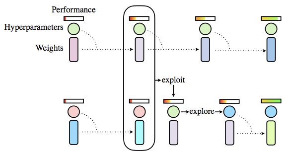

Population Based Training
=========================

.. _background-1:

Background
----------

Population Based Training (PBT) as introduced by Jaderberg et al. 2017
is an evolutionary type algorithm. The figure below shows a diagram of
what PBT is doing. PBT starts with a random population of hyperparamater
configurations. Each population member is trained for a limited amount
of time and evaluated. When every population member has been evaluated,
the ones with low scores replace their own weights and hyperparameters
with those from population members with high scores (exploit) and
perturb the hyperparameters (explore). Then all population members are
trained and evaluated again and the process repeats.

   PBT diagram

.. _sherpa-implementation-1:

SHERPA Implementation
---------------------

SHERPA implements this algorithm as follows. A population of
hyperparameter configurations is trained and evaluated for an amount of
time implicityly specified by the user through the Trial-script.
Population members are then sampled from the top third of the
population. For each sampled member each hyperparameter is randomly
increased, decreased, or held constant. Population members are always
sampled from the generation previous to the current one.

.. _example-1:

Example
-------

.. _trial-script-1:

Trial-Script
~~~~~~~~~~~~

In order to use PBT, the Trial-script needs to implement some additional
functionality as compared to the regular Trial-script. The parameters
are obtained as usual:

::

    client = sherpa.Client()
    trial = client.get_trial()

Load and Perturb
^^^^^^^^^^^^^^^^

The ``trial.parameters`` will now also contain the keys ``load_from``,
``save_to``, and ``lineage``. The ``lineage`` indicates the heritage of
this trial in terms of trial IDs and can be ignored at this point. The
``load_from`` key indicates whether weights need to be loaded. For
example in Keras:

::

    if trial.parameters['load_from'] == '':
        model = Sequential()
        model.add(Conv2D(32, kernel_size=(3, 3),
                         activation='relu',
                         input_shape=input_shape))
        model.add(Conv2D(64, (3, 3), activation='relu'))
        model.add(MaxPooling2D(pool_size=(2, 2)))
        model.add(Dropout(0.25))
        model.add(Flatten())
        model.add(Dense(128, activation='relu'))
        model.add(Dropout(0.5))
        model.add(Dense(num_classes, activation='softmax'))

        model.compile(loss=keras.losses.categorical_crossentropy,
                      optimizer=keras.optimizers.SGD(lr=trial.parameters['lr'],
                                                     momentum=trial.parameters['momentum']),
                      metrics=['accuracy'])
    else:
        model = load_model(os.path.join('./output', trial.parameters['load_from']))
        K.set_value(model.optimizer.lr, trial.parameters['lr'])
        K.set_value(model.optimizer.momentum, trial.parameters['momentum'])

Note that if the model is loaded then the user may have to change the
hyperparameters manually for compiled models.

Save
^^^^

After the model is trained and evaluated it is crucial that it is saved
to ``save_to``. The user can choose where to save the models to and what
exact name to give them so long each is identifiable by the number given
in ``save_to``.

::

    model.save(os.path.join('./output', trial.parameters['save_to']))

.. _runner-script-1:

Runner Script
~~~~~~~~~~~~~

The runner script is as usual. The parameters for the PBT algorithm are
population size, and parameter range. Population size is the number of
models that are randomly initialized at the beginning and the size of
every generation thereafter. The parameter ranges correspond to ranges
used by PBT for perturbation. The motivation for this parameter is that
one may want the initial models to be sampled from the ranges provided
in the regular way. The PBT parameter ranges if the space that
hyperparameters need to stay in via perturbation.

::

    pbt_ranges = {'lr':[0.0000001, 1.], 'batch_size':[16, 32, 64, 128]}
    algorithm = sherpa.algorithms.PopulationBasedTraining(population_size=50,
                                                          parameter_range=pbt_ranges)

..

    Jaderberg, Max, et al. “Population Based Training of Neural
    Networks.” arXiv preprint arXiv:1711.09846 (2017).
