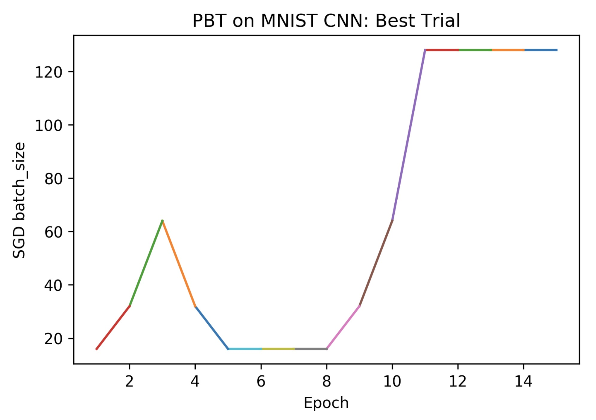

Population Based Training
=========================

Background
----------

Population Based Training (PBT) as introduced by Jaderberg et al. 2017
is an evolutionary algorithm for hyperparameter search. The figure below shows a diagram of
how it works. It starts with a random population of hyperparamater
configurations. Each population member is trained for a limited amount
of time and evaluated. When every population member has been evaluated,
the ones with low scores replace their own weights and hyperparameters
with those from population members with high scores (exploit) and
perturb the hyperparameters (explore). Then all population members are
trained and evaluated again and the process repeats.

.. figure:: pbt.png
   :alt: PBT Diagram from Jaderberg et al. 2017

SHERPA Implementation
---------------------

SHERPA implements this algorithm as follows. A population of
hyperparameter configurations is trained and evaluated for an amount of
time implicitly specified by the user through the Trial-script.
Population members are then sampled from the top third of the
population. Population members are always sampled from the generation
previous to the current one. For each sampled member each hyperparameter is randomly
increased, decreased, or held constant. In particular, the hyperparameter is
multiplied by 0.8, 1.0, or 1.2. These numbers can be adjusted via the
``perturbation_factors`` argument. The user can also specify parameter boundaries
for this perturbation process via the ``parameter_ranges`` argument. These ranges
operate independently from the ranges specified when defining each parameter. Instead
this argument limits the range in which each parameter can be perturbed to.

Example
-------

Trial-Script
~~~~~~~~~~~~

In order to use PBT, the Trial-script needs to implement some additional
functionality as compared to the regular Trial-script. The parameters
are obtained as usual:

::

    client = sherpa.Client()
    trial = client.get_trial()

Load and Perturb
^^^^^^^^^^^^^^^^

The ``trial.parameters`` will now also contain the keys ``load_from``,
``save_to``, and ``lineage``. The ``lineage`` indicates the heritage of
this trial in terms of trial IDs and can be ignored at this point. The
``load_from`` key indicates whether weights need to be loaded. For
example in Keras:

::

    if trial.parameters['load_from'] == '':
        model = create_model(trial.parameters)
    else:
        model = load_model(os.path.join('./output', trial.parameters['load_from'] + '.h5'))
        K.set_value(model.optimizer.lr, trial.parameters['lr'])
        K.set_value(model.optimizer.momentum, trial.parameters['momentum'])

Note that if the model is loaded then the user may have to change some
hyperparameters manually.

Save
^^^^

After the model is trained and evaluated it is crucial that it is saved
using ``save_to``. The user can choose where to save the models to and what
exact name to give them so long each is identifiable by the number given
in ``save_to``.

::

    model.save(os.path.join('./output', trial.parameters['save_to'] + '.h5'))

Runner Script
~~~~~~~~~~~~~

The runner script has the parameter ranges defined as usual.

::

    parameters = [sherpa.Continuous('lrinit', [0.1, 0.01], 'log'),
                  sherpa.Continuous('momentum', [0., 0.99]),
                  sherpa.Ordinal(name='batch_size', range=[16, 32, 64])]

The parameters for the PBT algorithm are
``population_size``, ``parameter_range``, and ``perturbation_factors``.
Population size is the number of models that are randomly initialized at the
beginning and the size of every generation thereafter. The parameter ranges
correspond to ranges used by PBT for perturbation. The motivation for this parameter is that
one may want the initial models to be sampled from the ranges provided
in the regular way. The PBT parameter ranges may be larger allowing model parameters
to drift in certain directions.

::

    pbt_ranges = {'lr':[0.0000001, 1.], 'batch_size':[16, 32, 64, 128]}
    algorithm = sherpa.algorithms.PopulationBasedTraining(population_size=50,
                                                          parameter_range=pbt_ranges)

And the optimization for trial script ``mnist_cnn.py`` is called as before.

::

    sherpa.optimize(algorithm=algorithm,
                    scheduler=scheduler,
                    parameters=parameters,
                    lower_is_better=True,
                    filename="mnist_cnn.py",
                    output_dir='./output')

A full example can be found in ``examples/mnistcnnpbt/`` from the SHERPA root
and run with ``python runner.py --env <path/to/your/environment``. Below are
some results from running the example. The plot below shows seed trials as
different colors with validation loss on the y-axis and epochs on the x-axis.
It can be seen how for each trial at each epoch many different
solutions are tried.

.. figure:: pbt-full.jpg
   :alt: Overall

For the trial with the best result one can plot the trajectory of the learning
rate, batch size, and momentum up to that best performance (here achieved at
epoch 15).

.. figure:: pbt-lr.jpg
   :alt: Learning Rate

.. figure:: pbt-momentum.jpg
   :alt: Momentum

..

    Jaderberg, Max, et al. “Population Based Training of Neural
    Networks.” arXiv preprint arXiv:1711.09846 (2017).
